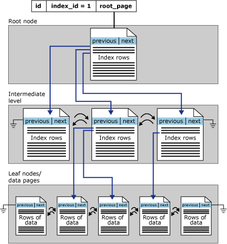

# Designing and Implementing SQL Server Database Indexes

Introduction to SQL Server Database Indexes.

## 1. General Indexing Guidelines

Why do we create indexes?

> Most of the time, we create indexes to improve the performance of our queries. We can also create indexes to enforce uniqueness, to enforce referential integrity, and to improve the performance of data modification operations.

In general, we might say that we're doing so:

1. to improve query performance,
2. to enforce data constraints (uniqueness).

> Indexes created for performance are determined by the workload! We need to understand the workload to determine the best indexes and be ready to change them as the workload changes.

When indexing a new system:

1. create indexes to support unique requirements,
2. create indexes on foreign key columns,
3. create indexes to support expected common queries,
4. be prepared to change indexes later!

When indexing an existing system:

1. identify the most resource-intensive queries,
2. identify the most important queries,
3. index to support them (not all of them but some of them - 5 is a good starting number),
4. re-investigate regularly!

## 2. Understanding Basic Index Architecture and Index Usage

To work effectively with indexes, we need to understand how they work.

### Indexing Architecture

In SQL Server data is stored in pages (8kB each). Pages are stored in extents (8 pages each). Extents are stored in data files. Data files are stored in filegroups. Filegroups are stored in databases.

In case of an index the data is sorted by the indexed column(s).

The indexing architecture is based on the B-tree data structure.

> A [B-tree](https://en.wikipedia.org/wiki/B-tree) is a self-balancing tree data structure that keeps data sorted and allows searches, sequential access, insertions, and deletions in logarithmic time.

### How SQL Server uses indexes

When we execute a query, SQL Server uses the indexes to find the data we're looking for. The query optimizer decides which index to use.

> The query optimizer is a component of SQL Server that determines the best way to execute a query. It uses statistics and other information to determine the best execution plan.

We have two main ways how SQL Server can use an index. It can `seek` or `scan` the index. In case of a `seek` we're navigating down the tree to find a value. In case of a `scan` we're reading leaf pages (some or all of them).

### Reading index-related execution plans operators

There are three operations that can be shown on an execution plan:

1. _Index Seek_ - navigation down the tree to find a value,
2. _Index Scan_ - read some or all of the leaf pages,
3. _Key Lookup_ - single-row seek to the clustered index.

## 3. Designing Indexes to Organize Tables (Clustered Indexes)

In SQL Server we have two main types of indexes:

1. Clustered Indexes

   Clustered indexes are the primary index for a table. They are used to store the data in the table and because of that they defines the physical storage of the table. There could be only one clustered index per table. If a table doesn't have a clustered index it is called a _heap_.

   

   Clustered indexes debate:

   a. create the clustered index to organize the table (preferred),

   b. create the clustered index on the most frequent access path.

   Clustered indexes guidelines: narrow, unique, unchanging, ever-increasing.

   Page splits are a problem for clustered indexes. They are expensive and can cause a lot of fragmentation.

   Clustered indexes trade-offs:

   | Organize the table                   | Support queries                                                  |
   | ------------------------------------ | ---------------------------------------------------------------- |
   | Table is as small as it can be       | Table may take up more space than necessary                      |
   | Minimal page splits                  | Potentially problematic page splits on inserts and updates       |
   | Less overhead on updates             | Clustered index can support queries using a frequent access path |
   | Need additional nonclustered indexes |

   Go for a compromise (example: dates in transactional tables).

2. Non-clustered Indexes (they aren't use to organize tables :-))

   

   Non-clustered indexes are used to store additional information about the data in the table. It is separate structure from the table. It is used to support queries. There could be many non-clustered indexes per table. Don't have to (and shouldn't) contain all columns. Always in sync with the table.

More info about clustered and nonclustered indexes can be found [here](https://learn.microsoft.com/en-us/sql/relational-databases/indexes/clustered-and-nonclustered-indexes-described?view=sql-server-ver15).

## 4. Designing Indexes to Improve Query Performance: Part 1

To improve query performance we can use clustered indexes and non-clustered indexes.

Architecture of a non-clustered index was presented in the previous section.

Common query predicates:

1. equality (`=`, `AND`),
2. inequality (`<>`, `!=`, `>`, `<`, `>=`, `<=`),
3. ORs (`OR`),
4. Joins (`JOIN`),
5. \*range (`>=`, `<=`, `BETWEEN`),
6. \*pattern (`LIKE`, `IN`).

### Indexing for equality

> When we use an equality predicate, SQL Server can use an index to find the data we're looking for. This is called an index seek.

Query must filter on a left-based subset of the index key.

> A left-based subset of the index key is a subset of the index key that starts with the first column in the index and continues with the next column in the index, and so on.

Order of index columns doesn't matter for a single query.

> The order of the columns in the index doesn't matter for a single query. SQL Server can use an index in any order.

Order does matter when trying to get multiple queries to use a single index.

> The order of the columns in the index does matter when we're trying to get multiple queries to use a single index. We need to make sure that the queries are filtering on a left-based subset of the index key.

### Indexing for inequality

Left-based subset of the index key.

> It is again seek operation not range scan as some might claim.

Equality columns before inequality columns.

Multiple inequalities are hard to index well.

### Indexing for ORs

Additional predicates increase the results.

> In many cases ORs can lead to a full table scan. We need to be careful when using ORs.

Needs multiple indexes for best performance.

## 5. Designing Indexes to Improve Query Performance: Part 2

### Indexing for joins

There are three types of join operations that might benefit from indexing. At the same time, we're seldom create indexes just for that purpose.

These types of joins are:

1. _Nested Loop_ - joins might benefit from an index on the inner table. The outer table is usually small so it doesn't benefit from an index.

2. _Hash Match_ - joins don't benefit from indexes.

3. _Merge_ - joins may benefit from indexes to provide necessary ordering.

### Include Columns

> Include columns are columns that are not part of the index key but are stored in the index at the leaf pages.

Include Columns are used to support queries that need additional columns. They were introduced in SQL Server 2008.

They are used to reduce the number of pages that need to be read to retrieve the data. We're using them to avoid expensive key lookups (key lookups are expensive because they require a seek operation).

Key lookups:

- single-row seek against the clustered index,
- fetch columns which are required but not in the key of the index used,
- slow if there is a large number.

Syntax for creating an index with include columns:

```sql
CREATE INDEX IX_Table_IncludeColumns
ON dbo.Table (Column1, Column2, Column3)
INCLUDE (Column4, Column5, Column6);
```

Once more: include columns are not used for filtering. They are used to support queries that need additional columns.

Include columns can make an index larger and in the result slower. We should use them, but not overuse them :-).

### Filtered Indexes

> Filtered indexes are indexes on a subset of rows in the table.

Can be useful on tables with skewed data.

> Filtered indexes can be useful on tables with skewed data. For example, if we have a table with 100 million rows and 99.9% of the rows have a value of 0 in a particular (bit) column, we can create a filtered index on that column that only includes the rows with a value of 1. Another practical example would be a table with a column that indicates whether a row is active or inactive (soft delete). We could create a filtered index on that column that only includes the active rows.

Also useful for complex unique constraints.

> Filtered indexes are also useful for complex unique constraints. For example, if we have a table with a unique constraint on two columns, we can create a filtered index on those two columns that only includes the rows that have `NOT NULL` value in the second column. This will allow us to insert `NULL` values into the second column many times, without violating the unique constraint.

Filter indexes have limitations, they don't work with parametrized queries.

Syntax for creating a filtered index:

```sql
CREATE INDEX IX_Table_Filtered
ON dbo.Table (Column1, Column2, Column3)
WHERE Column4 = 1;
```

Final note: we should create as many non-clustered indexes as needed, but no more!

## 6. Designing Indexed Views

> An indexed view (also called: **materialized view**) is a view that has an index on it. Indexed views are used to improve performance of queries that use the view.

Normally, views are just saved SELECT statements. It is possible to create a clustered index on a view. It is also possible to create a non-clustered index on a view. This materializes the view, persists its results as if it were a table. Contents of the view are automatically kept up to date as underlying tables change.

Indexed view has many requirements (or should I say - a massive number of limitations), some of them:

- first index must be a unique clustered index,
- certain SET options must be specified (these restrictions apply not only to the view but also to the underlying tables!),
- a view must be deterministic,
- must be created with `SCHEMABINDING` option,
- restricted T-SQL elements that can't be used inside the index:
  - columns must be listed explicitly,
  - no subqueries are allowed
  - `LEFT JOIN` not allowed (we can only use `INNER JOIN`),
  - we can't reference other views only base tables,
  - we can't use derived tables,
  - no `MIN` or `MAX`,
  - ... .

If there are so many limitations when indexed views are useful?

Two scenarios:

- aggregates (not for OLAP, but for OLTP),
- simple joins with filters.

Indexed views to be fully utilized must be used in conjunction with Microsoft SQL Server Enterprise Edition. To use indexed views in SQL Server Standard Edition we need to use a workaround, which is to add an option to the query hint (`NO EXPAND` - this option disables the expansion of the indexed view).

Indexed views are a niche feature. They are useful in some cases, but not in most of them.

Downside of indexed views:

- they are not (fully) supported in all editions of SQL Server,
- additional write overhead,
- additional space requirement,
- require specific SET options (there could be a situation when we had created an indexed view, but later maintenance tasks could fail due to these requirements).

More info about indexed views can be found [here](https://learn.microsoft.com/en-us/sql/relational-databases/views/create-indexed-views?view=sql-server-ver15).

## 7. Designing Columnstore Indexes for Analytic Queries

> Columnstore indexes are a new feature introduced in SQL Server 2012. They are designed to improve performance of analytical queries.

They are pretty similar to column-oriented databases. They are designed to store large amounts of data in a compressed format.

> They are indexes where the data for a column is stored together.

Columnstore indexes are not used for filtering, they are also poor for OLTP queries, especially for updates and inserts.

Columnstore indexes are good for analytical queries, especially for queries that use aggregates.

They are built differently than other indexes. They are built in a bottom-up, columnar, compressed fashion.


There are two types of columnstore indexes:

1. Clustered columnstore index - organizes the table, consists of all columns in the table.
2. Non-clustered columnstore index - secondary structure, contains just the columns specified.

To create a columnstore index we need to use the `CLUSTERED COLUMNSTORE INDEX` clause.

```sql
CREATE CLUSTERED COLUMNSTORE INDEX IX_Table_Columnstore
ON dbo.Table;
```

To create a non-clustered columnstore index we need to use the `NONCLUSTERED COLUMNSTORE INDEX` clause.

```sql
CREATE NONCLUSTERED COLUMNSTORE INDEX IX_Table_Columnstore
ON dbo.Table (Column1, Column2, Column3);
```

Columnstore indexes are not supported in all editions of SQL Server. They are supported in Enterprise and Developer editions, since SQL Server 2014 also in Standard edition.

Columnstore guidelines:

- clustered columnstore indexes on large fact tables,
- can add non-clustered rowstore (traditional :-)) indexes to help with searches,
- nonclustered columnstore indexes can help with analytics in OLTP systems.

They are not ideal for systems with lots of single-row modifications. Delta store is a normal B-Tree. Newly inserted rows aren't compressed. They are stored in a delta store. When the delta store is full, it is merged with the columnstore index. Inserts faster than tuple mover mary result in large delta stores.

Not efficient on small tables. Compression benefits from lots of rows. Also a problem with small partitions in partitioned tables.

Best on columns with repeated patterns in the data. Encrypted data doesn't compress. Data with high degree of randomness is not ideal.

Can't be used for seek operations. No keys in these indexes, not a B-Tree. May need additional nonclustered rowstore indexes for workloads with lots of small seeks.

Can't be used to enforce uniqueness. Primary key/unique constraints/unique index has to be a rowstore index.

Order of columns in columnstore index is not important, they aren't used for seeks, no 'left-based subset of the key'. For nonclustered columnstore indexes it is important to include all the necessary columns in the index (the one that will be used for aggregates and grouping).

More info about columnstore indexes can be found [here](https://learn.microsoft.com/en-us/sql/relational-databases/indexes/columnstore-indexes-overview?view=sql-server-ver15).

## Summary

Now you know how to design and implement SQL Server database indexes :-).

More info about Microsoft's guidelines how we should use indexes can be found [here](https://learn.microsoft.com/en-us/sql/relational-databases/sql-server-index-design-guide?view=sql-server-ver15).

There are other types of indexes:

- [XML indexes](https://learn.microsoft.com/en-us/sql/relational-databases/xml/xml-indexes-sql-server?view=sql-server-ver15),
- [Spatial indexes](https://learn.microsoft.com/en-us/sql/relational-databases/spatial/spatial-indexes-overview?view=sql-server-ver15).
