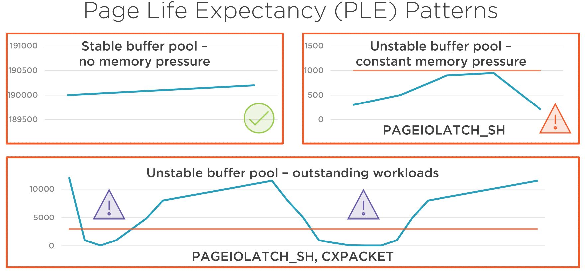

# Managing SQL Server Database Performance

SQL Server performance problems are real and troubleshooting can be a challenge.
This course will cover what factors affect performance and how to troubleshoot and
optimize performance both on-premise and with Azure SQL Database.

## 1. Aiming for Performance and Scalability

Scenario:

> Please help, I have performance problems!

Architecture:

- database application (client solution, desktop, web-based, mobile),
- workload (T-SQL ad-hoc queries, stored procedures, functions, views),
- database (SQL Server database on-promise on in the cloud).

Six degrees of performance problems:

- workload,
- environment and infrastructure,
- configuration,
- database,
- data,
- operations and maintenance.

Holistic Approach:

- workload,
- database environment.

Layered approach (from the outside):

- environment and infrastructure,
- SQL Server,
- database,
- query.

How to start troubleshooting:

- identify the problem,
- targeted troubleshooting,
- drill-down/top-down,
- choose the layer(s) directly to optimize.
- find entry points,
- follow branches,
- multidisciplinary paths.

> - **Service Level Agreements (SLA)** - a business requirement and/or agreement that our workload must adhere to, e.g., it has to complete in one minute.
> - **Performance** - my queries are running fast enough, always fall within business SLAs, the database application is responsive and my customers are happy with it.
> - **Scalability** - performance under changing constraints, e.g., data size grows, number of concurrent users increases, and peak usage times occur. You must be able to prove it with diagnostic data! It's measurable.

Get data for performance and scalability:

- **monitoring** - measure the environment and your workload, collect data, baseline, set up alerts,
- **diagnostics** - understand the problem, analyze the data, troubleshoot with entry points, plan,
- **optimization** - communicate, involve other disciplines, measure and validate, document.

Aiming for scalability and performance:

- business requirements,
- solution planning,
- usage patterns,
- infrastructure planning,
- SQL Server configuration,
- operations and maintenance.

Usage patterns:

- data growth trends,
- data table sizes,
- data distributions,
- concurrent users and peak times.

Infrastructure planning:

- choose the proper platform and technologies,
- plan with performance and scalability in advance,
- size properly and choose the correct tier.

SQL Server configuration:

- understand and know the platform,
- do regular health-checks,
- adjust configuration when necessary.

Operations and maintenance:

- have ownership of the environment,
- monitor, diagnose and optimize,
- maintain the database environment.

Sample database (_WorldWideImporters_) can be found [here](https://github.com/Microsoft/sql-server-samples/blob/master/samples/databases/wide-world-importers).

SQL Server performance optimization is more like an art.

## 2. Understanding Key SQL Server Concepts

### Major Versions and Compatibility Levels

SQL Server major versions:

- SQL Server 2012 (11.0 v11),
- SQL Server 2014 (12.0 v12),
- SQL Server 2016 (13.0 v13),
- SQL Server 2017 (14.0 v14),
- SQL Server 2019 (15.0 v15).

SQL Server product lifecycle:

- RTM (start of life),
- 5 years of mainstream support,
- 5 years of extended support,
- EOL (end of life).

Database compatibility level:

- will be presented in detail later,
- it has impact on performance (example):
  - 110 (Legacy Cardinality Estimation (CE) v70),
  - 120 (New CE v120).

Patch level and servicing example:

- SQL Server 2016 SP1 CU1 (13.0.4001.0).

To query server version use:

```sql
/*
returns:
major version,
patch version,
latest CU/KB article applied,
edition,
OS version,
CPU architecture.

example:
*/
SELECT @@VERSION AS [SQL Server Version];
```

To query detailed server version information with T-SQL use:

```sql
SELECT
  SERVERPROPERTY('ProductBuild') AS BuildNumber,
  SERVERPROPERTY('ProductLevel') AS VersionLevel,
  SERVERPROPERTY('ProductMajorVersion') AS MajorVersion,
  SERVERPROPERTY('ProductMinorVersion') AS MinorVersion,
  SERVERPROPERTY('ProductUpdateLevel') AS UpdateLevel,
  SERVERPROPERTY('ProductUpdateReference') AS UpdateReference,
  SERVERPROPERTY('ProductVersion') AS ProductVersion;
```

Search the Microsoft Knowledge Base for the latest CU/KB article.

How to use the KB articles:

- search term site:support.microsoft.com

KB article URL format.

KB321185 to read.

### Patch Levels and Servicing

Important servicing updates.

No SP from SQL Server 2017 onwards.

Service Pack still released for earlier versions.

Proactive and ongoing patching with CUs.

Why does the Major Version matter?

- set of available features,
- workload behavior,
- troubleshooting, configuration and problem resolution options,
- supportability and patching options.

Why does the Patch Level matter?

- security,
- stability,
- performance,
- new features and behavior.

What is included in a CU package:

- bug fixes for multiple services,
- performance fixes and improvements,
- feature improvements,
- security fixes and improvements.

### Editions and Best Practices

SQL Server editions:

- Express,
- Web,
- Standard,
- Enterprise,
- Developer.

Why does the Edition matter?

- feature limitations,
- scale and resource utilization limits,
- licensing costs.

To check your edition use:

```sql
SELECT @@VERSION AS [Server_Version_Edition];
SELECT SERVERPROPERTY('Edition') AS [Edition];
/* reading the current SQL ERRORLOG header */
EXEC sp_readerrorlog 0, 1, N'Copyright';
```

Version and edition best practices:

- keep the major version supported:
  - preferably within the mainstream support phase,
- keep the patch level supported:
  - patch proactively and regularly with SPs and CUs,
  - set up retention policy and test,
- use Developer edition for testing,
- research the edition and feature matrix.

### Server Instances

What is and instance?

- each instance is a separate SQL Server with:
  - system and user databases,
  - configuration,
  - TCP port number,
- multiple instances of the database service can be installed side-by-side on the same machine:
  - one default instance and multiple named instances,
  - can even mix major versions.

Instances and performance optimization:

- multi-instance deployments:
  - create scalability problems,
  - make performance troubleshooting and optimization more complex,
  - make operations more complex,
- consolidate with virtualization,
- do not stack SQL Server instances in production:
  - aim for one instance per server.

### Server Configuration Options

Which settings to change from the default?

- must change (?):
  - max server memory,
  - min server memory,
  - max degree of parallelism (MAXDOP),
  - cost threshold for parallelism,
- might change:
  - optimize for ad-hoc workload,
- do not change:
  - priority boost.

Validate and pre-configure the instance for:

- memory settings,
- CPU configuration,
- parallelism settings.

Verify all settings in `sys.configurations`.

Verify the SQL ERRORLOG files.

### Database Configuration Options

Information stored in:

- `sys.databases`,
- `sys.database_scoped_configurations` (SQL Server 2016+),

Database SET options:

- a fet SET options of interest:
  - COMPATIBILITY_LEVEL,
  - AUTO_CLOSE and AUTO_SHRINK,
  - auto create and auto update statistic options,
  - RECOVERY,
  - AUTOMATIC_TUNING (SQL Server 2017+),
- `sys.databases` view,
- `sys.database_automatic_tuning_options` view,
- `DATABASEPROPERTYEX` function.

Database scoped configurations:

- common scoped configuration options:
  - MAXDOP,
  - LEGACY_CARDINALITY_ESTIMATION,
  - QUERY_OPTIMIZER_HOTFIXES,
  - CLEAR_PROCEDURE_CACHE.

Configuration hierarchy:

- server configuration (`sp_reconfigure`),
- database scoped configuration (`ALTER DATABASE SCOPED CONFIGURATION SET ...`),
- query hint (`OPTION (...)`).

### Trace Flags

What is a trace flag:

- a switch to alter SQL Server behavior:
  - referred as: TFnnnn (e.g: TF1118),
- mostly designed for short-term troubleshooting by MS customer support:
  - many should not be used in production,
  - can cause serious problems,
- but: a few are useful and have become the baseline or otherwise recommended,
- can be set at:
  - server level (global - `DBCC TRACEON(9481);` or as startup parameters (-T)),
  - session level (per connection - `DBCC TRACEON(9481, -1);`),
  - query level (per query - `OPTION (QUERYTRACEON 9481)`).

Performance trace flag use cases:

- common scenarios:
  - optimize tempdb in pre-SQL2016 versions,
  - turn on Query Optimization fixes,
  - control the version of Cardinality Estimator to be used,
  - control how and when statistics are being automatically updated,

Worth investigating:

- 4199,
- 9481 and 2312.

Since SQL2016+ trace flags are not encouraged.

Useful code:

```sql
DBCC TRACESTATUS(-1); -- check all trace flags configured globally
DBCC TRACEOFF(9481); -- turn off trace flag 9481 in the session
DBCC TRACEOFF(9481, -1); -- turn off trace flag 9481 globally
```

Trace flags and performance:

- TFs really can make a difference, pro and con,
- it is hard to track the settings and the changed behaviors across different versions and scopes,
- TF usage or the equivalent configuration must be justified and documented.

### Tempdb

What is tempdb:

- shared container to be used by everyone in the same server instance,
- one tempdb database per instance,
- you can explicitly create objects in it (#, ##),
- SQL Server uses it for internal objects and certain features too,
- reset with each service restart.

Tempdb - what is it for?

- temporary user objects:
  - \# and \#\# tables,
  - table variables,
  - TVF return tables,
- version store:
  - RCSI and snapshot,
  - triggers,
  - always on AG read-only replicas,
- internal structures:
  - sorts,
  - hash joins and aggregates,
  - cursors,
  - "spills".

Tempdb performance factors:

- IO - read/write the data file(s) and the log file with varying IO sizes,
- internal allocation - SQL Server internal algorithms to allocate objects and manage metadata.

Common tempdb performance problems due to:

- slow storage,
- memory bottlenecks,
- configuration issues,
- badly written applications.

Plan with tempdb usage in-advance.

Pre-configure.

Monitor and adjust.

### Transaction Log and Recovery Models

Recovery models:

- Simple - automatic log clearing: full and differential backups only,
- Full - log clearing only with log backup: full, differential and log backups,
- Bulk-logged.

What is a transaction log:

- .ldf file:
  - each database has one and should have only one log file,
- write-ahead logging mechanism:
  - everything is a transaction,
- ACID properties (Durability),
- basic for database recovery.

Transaction log management:

- sequential write IO,
- composed of VLF.

Transaction log and performance:

- do frequent enough log backups (in Full),
- instant file initialization does not help,
- use fixed and meaningful growth values, pre-size the file,
- watch out for long running transactions,
- do not shrink the file regularly,
- importance of log IO performance:
  - sequential write IO patterns.

### Memory Management and SQLOS

SQL Server resource management:

- CPU/scheduling - serial and parallel plans, number of cores and performance,
- memory - buffer pool, plan cache and query workspace,
- IO - random and sequential read/write IO patterns.

Plan cache memory.

![Plan cache memory][images/02_01_plan_cache_memory.jpg]

Plan cache memory and performance:

- managed dynamically,
- under throttling by SQL Server,
- importance of solution design:
  - can be bloated in size with adhoc plans,
- `sys.dm_exec_cached_plans` view.

Buffer pool memory usage.

![Buffer pool memory usage][images/02_02_buffer_pool_memory_usage.jpg]

Buffer pool memory sizing.

Buffer pool memory and performance:

- managed dynamically, can grow and shrink,
- aim is to have a proper size to limit costly physical IO operations,
- aim is to have a stable size,
- server configuration options:
  - min and max server memory,
- `sys.dm_os_buffer_descriptors` view.

Memory management and performance:

- KB2663912 to read,
- SQL Server uses many other types of memory allocations:
  - plan cache,
  - connections,
  - query executions,
  - external modules,
- `sys.dm_os_memory_clerks` view.

### Wait Statistics and the Threading Model

## 3. Optimizing SQL Server Instance and Memory Configuration

### Server Health Check

It is important to have some kind of a server health check repository.

When do you need a server health check?

- after installing SQL Server,
- before going into production,
- regularly as part of operations and maintenance.

What do you verify in a server health check?

- host environment (hardware, OS),
- SQL Server configuration,
- database settings,
- SQL Server ERRORLOG files,
- scheduled jobs,
- custom (something that is specific to a particular environment).

### Memory Settings

Configuration SQL Server memory settings:

- max server memory,
- min server memory,
- lock pages in memory.

Buffer pool memory sizing.

Single-instance dedicated `max server memory` formula:

> physical memory - 4 GB (or 10% whichever is greater to leave some GBs for the OS) - (memory not controlled by `max server memory`).

Hosting other services on the database servers reduces the scalability of the SQL Server instance,
external memory pressure scenarios can happen.

Use the `sp_configure` system stored procedure to set server configuration options to prevent potential UI data entry errors.

To check memory configuration settings:

```sql
:CONNECT .\INSTANCE

EXECUTE sp_configure 'show advanced options', 1;
GO
RECONFIGURE;
GO
EXECUTE sp_configure 'min server memory (MB)', 2048;
GO
EXECUTE sp_configure 'max server memory (MB)', 4096;
GO
RECONFIGURE;
GO
```

KB2663912 to read on changes regarding what memory allocations besides the buffer pool the `min server memory (MB)` and `max server memory (MB)` settings control from SQL2012 onwards.

SQL Server ERRORLOG files.

Lock pages in memory - without it we might experience this error in an error log:

> A significant part of SQL Server process memory has been paged out. This may result in a performance degradation. Duration: 0 seconds. Working set (KB): ..., committed (KB):..., memory utilization: 29%.

To fix that we should grant `Lock pages in memory` permission to the SQL Server service account.

Some would argue that this fix should be applied only if we're experienced these errors.

Review other server configuration settings:

- optimize for ad hoc workloads,
- max degree of parallelism,
- cost threshold for parallelism.

To check if we're using `optimize for ad hoc workloads` we can use:

```sql
SELECT * FROM sys.configurations WHERE name = 'optimize for ad hoc workloads';
```

We can check if that is the case by verifying plan cache stats and focusing on 'ad-hoc' plans usage.

SQL Server VM Memory Settings Example:

- VM RAM (32 GB),
- max server memory (28 GB),
- VM reserved memory (14 GB),
- min server memory (10 GB).

System Data Collection Method Examples:

- system information,
  - method: ERRORLOG files and @@version, sys.dm_os_sys_info, sys.dm_os_schedulers, msinfo32 (Windows)
- errors and exceptions:
  - ERRORLOG files, event logs (Windows),
- memory dumps:
  - sys.dm_server_memory_dumps, ERRORLOG files,
- database corruption:
  - DBCC CHECKDB job failures,
  - msdb..sysjobhistory,
  - msdb..suspect_pages.
- SQL Server performance counters:
  - sys.dm_os_performance_counters,
- wait statistics:
  - sys.dm_os_wait_stats, sys.dm_exec_session_wait_stats,
- database file IO:
  - sys.dm_io_virtual_file_stats,
- system level bottlenecks:
  - ERRORLOG files,
- missing indexes and index usage:
  - sys.dm_db_missing_index_groups, sys.dm_db_missing_index_details, sys.dm_db_index_usage_stats, sys.dm_db_index_group_stats.

### Parallelism Settings

To check parallelism settings we can use:

```sql
select * from sys.configurations
where name in ('max degree of parallelism', 'cost threshold for parallelism');
```

To know how many schedulers there are we can use:

```sql
select * from sys.dm_os_schedulers;
```

To change `max degree of parallelism` we can use:

```sql
:CONNECT .\INSTANCE

EXECUTE sp_configure 'show advanced options', 1;
GO
RECONFIGURE;
GO
EXECUTE sp_configure 'max degree of parallelism', 4;
-- let's assume that I have 8 schedulers, so I can set it to 4,
-- by setting this value to 0 I can disable parallelism
GO
RECONFIGURE;
GO
```

To know how to set MAXDOP we need to know our situation, for example Microsoft SharePoint is an
example of major product having a MAXDOP = 1 prerequisite.

Excessive parallelism shows up in wait statistics as CXPACKET waits with high wait
counts and bad average wait times.
Optimize the workload, optimize indexing and adjust parallelism settings but do not turn it off.

Always review KB2806535 on how to preset server level MAXDOP depending on the hardware environment
and SQL Server major version.

In case of `cost threshold for parallelism` we can use:

```sql
:CONNECT .\INSTANCE

EXECUTE sp_configure 'show advanced options', 1;
GO
RECONFIGURE;
GO
EXECUTE sp_configure 'cost threshold for parallelism', 100;
GO
RECONFIGURE;
GO
```

### ERRORLOG Files

ERRORLOG files are the most important source of information about SQL Server instance health.

ERRORLOG files are located in the SQL Server log directory.

ERRORLOG files are rotated daily.

ERRORLOG files are text files.

It is a good practice to increase the number of ERRORLOG files.

Just for testing, to create a stack dumps manually we can use DBCC STACKDUMP.

Stack dumps are created in the SQL Server log directory.

If I/O is a bottleneck you can see in your error log:

> SQL Server encountered \<n> occurrence(s) of I/O requests taking longer than \<n> milliseconds to complete on file \<file name> in database \<database name>(\<database ID>). The OS file handle is \<file handle>. This may be a symptom of physical disk bottlenecks. Check related errors.

Another message worth investigation is related to autogrowth:

> Auto growth of the file \<file name> in database \<database name> took \<n> miLliseconds. Consider using ALTER DATABASE to set a smaller FILEGROWTH for this file.

Also we can find in an error log certain errors:

> Error 823: The operating system returned error 21(The device is not ready.) to SQL Server during a read at offset 0x0000000000000000 in file 'C:\Program Files\Microsoft SQL Server\MSSQL12.MSSQLSERVER\MSSQL\DATA\master.mdf'. Additional messages in the SQL Server error log and system event log may provide more detail. This is a severe system-level error condition that threatens database integrity and must be corrected immediately. Complete a full database consistency check (DBCC CHECKDB). This error can be caused by many factors; for more information, see SQL Server Books Online.

Always collect and analyze the ERRORLOG files within a server health check and begin the performance
troubleshooting and optimization by looking for red flags.

## 4. Optimizing Tempdb and User Database File Configuration

Server health check items:

- tempdb file configuration:
  - number of data files,
  - sizing of data files,
- trace flags depending on major version:
  - TF1118,
  - TF1117,
- database instant file initialization,
- file autogrowth settings.

Additional external factors:

- storage configuration and tiers,
- data, transaction log, and tempdb file separation onto different drives/disks,
- drive formatting:
  - 64 KB NTFS allocation unit size,
- antivirus configuration:
  - KB309422 to read for exclusion paths.

### Database File IO

Database IO latency:

- for data files (\*.mdf, \*.ndf) it is OK if < 25 ms,
- for log files (\*.ldf) it is OK if < 5 ms.

Database files on SSD storage:

- use SSD storage for production workloads:
  - average IO latency in the few milliseconds range,
- if otherwise:
  - storage properly configured or tiered,
  - no SQL Server memory pressure,
  - workload is optimized,
  - index usage is optimal,
  - other external factors do not interfere.

Monitoring IO performance:

- windows performance monitor (Perfmon):
  - LogicalDisk object counters,
- SQL Server views:
  - sys.dm_io_virtual_file_stats,
- SQL Server wait statistics:
  - PAGEIOLATCH_SH,
  - PAGEIOLATCH_EX,
  - WRITELOG.

### Instant File Initialization and Tempdb Bottlenecks

Database file zero initialization.

Database instant file initialization:

- no zero initialization on:

  - create,
  - autogrow,
  - restore.

- applies to the data files only:
  - log files are always zeroed,
- perform volume maintenance tasks security policy,
- evaluate security considerations.

Tempdb performance factors:

- IO - read/write the data file(s) and the log file with varying IO sizes,
- internal allocation - SQL Server internal algorithms to allocate objects and manage metadata.

How to measure these tempdb bottlenecks?

- IO - subpar read/write latency values seen with Perfmon and sys.dm_io_virtual_file_stats on tempdb files and disk,
- tempdb contention - PAGELATCH_UP, PAGELATCH_EX wait types, with bad average wait times and wait resources in tempdb.

How to alleviate tempdb IO bottlenecks?

- IO performance:
  - use SSD storage,
  - use multiple tempdb data files,
  - separate tempdb files from all the rest,
  - separate tempdb log files from data files,
  - optimize autogrowth settings,
  - database instant file initialization,
  - optimize workload,
  - resolve memory configuration problems,
- tempdb contention:
  - use SQL2016+,
  - use TF1118 with pre-SQL2016 instances,
  - use multiple tempdb data files,
  - pre-size the tempdb data files,
  - size all data files equally,
  - configure fixed equal autogrow values,
  - use TF1117 with pre-SQL2016 instances,
  - optimize workload.

### Autogrowth Settings

Database instant file initialization configuration changes require a service restart to take effect.

In SQL2016+ information about instant file initialization will be available in the ERRORLOG file.

> Database Instant File Initialization: enabled. For security and performance considerations...

Also we can check (`instant_file_initialization`):

```sql
select * from sys.dm_server_services;
```

Also we can check security policies to verify that the SQL Server account has the required permissions to perform volume maintenance tasks (that is "Perform volume maintenance tasks" policy).

To verify autogrowth settings we can use (`max_size`, `growth`, `is_percent_growth`):

```sql
select * from sys.master_files;
```

We can do that for a particular database:

```sql
select * from sys.database_files;
```

Default 10% is not a good idea, it is better to define our own fixed autogrowth settings.

Example of fixed growth setting: 8192 \* 8 KB = 65536 KB = 64 MB.

### Tempdb Configuration

In SQL2016+ TF1117 and TF1118 are enabled by default.

In older versions by default you would have one data file and one log file in a newer versions that
would be configured more reasonably.

Number of tempdb data files when having 8 or less schedulers = no. of schedulers.
Number of tempdb data files when having more than 8 schedulers = 8.
Do not add more data files than logical processors and monitor impact.

To check number of schedulers:

```sql
select * from sys.dm_os_schedulers;
```

To check number of logical processors:

```sql
select * from sys.dm_os_sys_info;
```

While number of files would be OK, the size of the files is not and should be pre-sized.

KB2154845 to read on addressing tempdb contention and recommended number of tempdb data files.

## 5. Configuring SQL Server in Azure

Choosing a cloud SQL Server solution.

Why choosing SQL Server in Azure?

- cost,
- operations,
- availability,
- modernization.

Additional benefits of Azure SQL solutions:

- security - Azure integrated security solutions,
- scalability - upscaling and downscaling options, tiered offerings,
- automatic tuning - automatic performance tuning options.

### SQL Server in Azure

Three main SQL Server in Azure offerings:

- IAAS - SQL Server VM - full-fledged instances just as if they were on-premise,
- PAAS - Azure SQL Database - managed platform-as-a-service offering, no server instance,
- PAAS - Managed Instance - managed platform-as-a-service offering, server instance available.

### SQL Server Virtual Machines

Full-fledged server instances managed by you as if they were on-premise.

What is applicable to on-premise is relevant here too:

- planning and sizing,
- deployment,
- patching,
- configuration,
- performance optimization,
- operations and maintenance.

### Creating SQL Server Virtual Machines and Sizing

Tiered resources.

Multiple VM series and sizes.

Azure compute units (ACU).

Tiered storage options.

Azure VM series determines:

- available VM sizes (vCPU and memory),
- storage type supported (premium vs. standard),
- CPU architecture and ACU,

Azure VM size determines:

- tempdb storage size (drive D),
- maximum number of data disks,
- disk performance (IOPS, throughput),
- network bandwidth.

What's best for SQL Server:

- sizes for Windows virtual machines in Azure,
- understand each series, limits and scales,
- understand your workload to choose the best VM [series](https://azure.microsoft.com/en-us/pricing/details/virtual-machines/series/) and [size](https://learn.microsoft.com/en-us/azure/virtual-machines/sizes),
- SQL Server VM performance [guidelines](https://learn.microsoft.com/en-us/azure/azure-sql/virtual-machines/windows/performance-guidelines-best-practices-checklist?view=azuresql).

SQL Server VM Azure checklist example:

- choose the proper VM series and size,
- do a platform health check,
- use Premium (SSD) managed disks in production:
  - choose proper storage tiers, P30 disks at minimum,
  - configure storage caching properly,
- optimize tempdb performance:
  - move to local SSD (drive D) if needed.

### Azure SQL Database

Main features:

- single or elastic databases,
- no physical server instance,
- partial compatibility with on-premise,
- Enterprise Edition features,
- automatic tuning options,
- tiered service.

Managing Azure SQL Database performance:

- built-in performance monitoring:
  - performance overview,
  - performance recommendations,
  - intelligent insights,
  - automatic tuning,
- Query Store,
- Azure SQL Database specific views:
  - sys.dm_db_wait_stats.

Azure SQL Database service tiers:

- purchase models:
  - vCore and DTU,
- service tiers:
  - DTU: Basic, Standard, Premium,
  - vCore: general purpose, business critical, hyperscale.

Single database resource limits:

- resource limits within service tiers,
- multiple compute sizes in a service tier:
  - Standard tier: S0 to S12,
- compute size comes with limits on:
- maximum DTU,
- maximum storage,
- maximum concurrent workers and sessions,
- tempdb size (number of data files, file sizes).

Choosing a service tier:

- [DTU calculator](https://dtucalculator.azurewebsites.net/),
- [Data migration assistant (DMA)](https://learn.microsoft.com/en-us/sql/dma/dma-overview?view=sql-server-ver15).

### Elastic Pools

Options:

- single database: DTU/vCore,
- elastic pool: eDTU/vCore.

Azure SQL Database Elastic Scale.

Elastic pool resource limits:

- resource limits within service tiers,
- multiple eDTU sizes in a service tier:
  - Standard tier: 50 to 3000,
- eDTU size comes within limits on:
  - maximum storage per pool,
  - maximum number of databases,
  - minimum and maximum eDTU per database,
  - tempdb size (number of data files, file sizes).

Elastic pool utilization patterns:

- use the 1.5x multiplier for elastic pools:
  - sum of single database resources > eDTU x 1.5,
  - eDTU cost = DTU x 1.5,
  - peak DTU > average DTU x 1.5,
- single database peaks mostly do not overlap,
- two thirds of the pooled databases should peak to their resource limit at maximum,
- count with storage requirements too.

Elastic pool size estimation:

- to estimate an elastic pool size in eDTU:
  - (total number of databases) x (average DTU utilization per database),
  - (number of concurrently peaking databases) x (peak DTU utilization per database),
- whichever is larger of the above,
- aggregate the storage requirement for all databases and see which eDTU size matches,
- take the larger of eDTU sizes from above and use the Azure calculator for costs.

### Estimating Service Tiers and Sizes

Azure SQL Database scaling options:

- scale-up:
  - move to a higher tier or compute size,
- scale-down:
  - move to a lower tier or compute size,
- scale-out:
  - report offloading to a read-only replica,
  - database sharding with elastic database tools.

## 6. Troubleshooting and Baselining the Environment

It is important to understand the environment and its performance baseline.

### Troubleshooting and Baselining in SQL Server

Performance problems timeline:

- service startup data and time:
- RCA,
- intermittent,
- persistent.

Root cause analysis (RCA):

- service startup date and time,
- retention period (persisted data collections: system health, query store, error logs).

Performance baselining:

- months:
  - system health,
  - query store,
  - error logs,

Useful data:

- wait statistics,
- dynamic management views (DMVs),
- query store,
- system_health session trace,
- Perfmon trace.

### Wait Statistics in Practice

Wait statistics toolset:

- `sys.dm_os_wait_stats`,
- `sys.dm_db_wait_stats`,
- `sys.dm_exec_session_wait_stats`
- Query Store,
- custom trace.

Multi-level wait statistics:

| Level                         | Method                         |
| ----------------------------- | ------------------------------ |
| Server instance               | sys.dm_os_wait_stats           |
| Database (Azure SQL Database) | sys.dm_db_wait_stats           |
| Session                       | sys.dm_exec_session_wait_stats |
| Query                         | custom trace, Query Store      |

Server-level wait statistics:

`sys.dm_os_wait_stats`:

- cumulative since last restart of server,
- can be cleared manually too,

Good for:

- overall server health-check,
- collecting server baselines,
- identifying problem patterns and troubleshooting entry points.

Use custom query to collect and analyze.

A widely used wait statistics [query](https://www.sqlskills.com/blogs/paul/wait-statistics-or-please-tell-me-where-it-hurts/).

Used for server level waits analysis.

It should be part of your toolset every time!

What it does:

- shows the prevalent waits only,
- calculates average wait times,
- excludes benign waits.

### IO and CPU Related Wait Type Patterns

Common IO and CUP wait types:

- **PAGEIOLATCH_XX** - IO wait when reading pages from disk in SH or EX mode,
- **WRITELOG** - IO wait when writing the transaction log,
- **CXPACKET** - parallelism is present,
- **SOS_SCHEDULER_YIELD** - persistent CPU utilization.

### OS, Locking, and Data Page Related Wait Type Patterns

Common OS, locking, and data page related wait types:

- **PREEMPTIVE_OS_WRITEFILEGATHER** - NTFS zero file initialization,
- **PREEMPTIVE_OS_AUTHENTICATIONOPS** - DC authentication,
- **LCK_M_S** - waiting to acquire shared locks,
- **LCK_M_X**, **LCK_M_IX** - waiting to acquire exclusive locks,
- **PAGELATCH_SH** - waiting to access data pages in-memory for read,
- **PAGEIOLATCH_EX**, **PAGEIOLATCH_UP** - waiting to access data pages in-memory for modification.

### Wait Statistics Patterns in Troubleshooting

Pattern changes example:

| Before           | After               |
| ---------------- | ------------------- |
| CXPACKET         | SOS_SCHEDULER_YIELD |
| WRITELOG         | LCK_M_S             |
| PAGEIOLATCH_EX   | WRITELOG            |
| BACKUPIO         | LCK_M_IX            |
| OLEDB            | PAGELATCH_EX        |
| ASYNC_NETWORK_IO | ASYNC_NETWORK_IO    |
| LCK_M_S          | CXPACKET            |
| LCK_M_IX         | PAGEIOLATCH_SH      |

### Wait Statistics Analysis with Custom Query

Understanding wait statistics results:

- waits are normal, filter out good waits,
- focus on the prevalent waits types, wait counts and average wait times,
- there are hundreds of wait types, only a dozen or two will show up as prevalent,
- look for changes in patterns,
- look for red flag or poison waits:
  - THREADPOOL,
  - RESOURCE_SEMAPHORE.

Comprehensive wait statistics libraries:

- [Microsoft](https://learn.microsoft.com/en-us/sql/relational-databases/system-dynamic-management-views/sys-dm-os-wait-stats-transact-sql?view=sql-server-ver15),
- [SQLSkills](https://www.sqlskills.com/help/waits/).

Get production samples and get familiars with patterns:

- don't focus on memorizing all the wait types.

### IO Performance Troubleshooting with DMVs

DMVs provide internal version of specific (diagnostic) data.

DMVs for many areas:

- SQLOS: `sys.dm_os_wait_stats`,
- IO: `sys.dm_io_virtual_file_stats`,
- databases,
- indexes,
- server instance,
- transactions.

A widely used IO statistics [query](https://www.sqlskills.com/blogs/paul/how-to-examine-io-subsystem-latencies-from-within-sql-server/).

Used for database file level IO statistics.

It should be part of your toolset every time!

What it does:

- uses `sys.dm_io_virtual_file_stats`,
- calculates latency values and averages.

### IO Performance Analysis with Custom Query

Using custom script for file level IO statistics data collection and analysis.

### Query Store

Query Store availability:

- on-premise or IaaS:
  - turned off by default,
- Azure SQL Database:
  - turned on by default.

Query Store:

- persistent store at database level,
- flight-recorder of query plans and runtime statistics,
- query wait statistics added in SQL2017,
- used for:
  - tracking query performance over time,
  - tracking query plan changes over time,
  - addressing query plan regression,
  - helping developers in query optimization.

### Using the Query Store for Query Performance Analysis

Using the Query Store in Azure SQL Database to track query performance.

### System_health Session Trace

System_health session trace:

- built-in extended event trace session,
- trace files in the SQL Server log folder:
  - system_health.xel,
- collect for example:
  - selected error numbers,
  - CPU and memory related errors and problems,
  - sp_server_diagnostics outputs,
  - deadlock graphs.

### Using the System_health Session Trace for Troubleshooting

Using the system_health session trace with an on-premise SQL Server instance.

Using SSMS for trace analysis.

### Perfmon Traces

Perfmon trace:

- system and SQL Server object counters,
- used for trend analysis and to see the details in context,
- collect when the problem occurs or for baselining,
- collect with:
  - Windows Performance Monitor (all counters),
  - `sys.dm_os_performance_counters` view (SQL Server cached counters).

What to collect in a Perfmon Trace?

- system objects and counters:
  - Processor and memory,
  - Logical Disk:
    - Avg. disk sec/read,
    - Avg. disk sec/write,
- SQL Server objects and counters:
  - Buffer Manager and Memory Manager,
  - access methods,
  - databases,
  - general statistics and SQL statistics.

Analyzing Perfmon Traces:

- Windows Performance Monitor UI:
  - manual analysis, to see all the details,
- [PAL utility](https://github.com/clinthuffman/PAL):
- PAL is very good for:
  - quick analysis and overview,
  - providing nice report with charts, explanations and thresholds.

### Interesting SQL Server Counters

You might be interested in:

- Buffer Manager:
  - page life expectancy,
- SQL Statistics:
  - Batch requests/sec,
- Access Methods:
  - Full Scans/sec,
- General Statistics:
  - Processes blocked,
- Memory Manager:
  - Total server memory.

### Page Life Expectancy Patterns



### Using and Analyzing Perfmon Traces

Creating a SQL Server Perfmon trace with Windows Performance Monitor.

Using the PAL tool to analyze the Perfmon trace.

Querying the `sys.dm_os_performance_counters` view.

Using relog.exe to export the binary trace into a database for custom reporting.

## 7. SQL Server 2019 Improvements

### Database and Server Upgrade

Supportability, security, performance and new features.

### Versions, Editions, and Patching

SQL Server major versions:

- SQL Server 2012 (11.0 v11),
- SQL Server 2014 (12.0 v12),
- SQL Server 2016 (13.0 v13),
- SQL Server 2017 (14.0 v14),
- SQL Server 2019 (15.0 v15).

Database compatibility levels:

- major version (supported compatibility levels):
  - SQL2019: 150 140 130 120 110 100,
  - SQL2017: 140 130 120 110 100,
  - SQL2016: 130 120 110 100,
  - SQL2014: 120 110 100,
  - SQL2012: 110 100.

Compatibility level impact on performance:

| Compatibility Level 140              | Compatibility Level 150             |
| ------------------------------------ | ----------------------------------- |
| Cardinality Estimator (CE) v140      | Cardinality Estimator (CE) v150     |
| Automatic tuning                     | Batch mode on rowstore              |
| Adaptive joins for batch mode        | Memory grant feedback for row mode  |
| Interleaved execution                | Scalar UDF inlining                 |
| Memory grant feedback for batch mode | Table variable deferred compilation |

Why does edition matter?

- feature limitation,
- scale and resource utilization limits,
- licensing cost.

SQL Server edition and [feature matrix](https://learn.microsoft.com/en-us/sql/sql-server/editions-and-components-of-sql-server-2019?view=sql-server-ver16):

- Express (1 socket or 4 cores, 1.4 GB buffer pool memory),
- Standard (4 sockets or 24 cores, 128 GB buffer pool memory),
- Enterprise (unlimited sockets or cores, 128 GB buffer pool memory).

SQL Server 2019 servicing.

No service packs form SQL2017 onwards:

- modern servicing model.

CU18 for SQL Server 2019, more info [here](https://sqlserverbuilds.blogspot.com/).

### Setup

Setup improvements:

- server install,
- configuration options,
- recommended server configuration options.

New setup options and features:

- memory - recommended min and max server memory (MB) values,
- MAXDOP - recommended max degree of parallelism,
- licensing - server/cal licensing warning tied to the number of CPU cores.

### Tempdb Improvements

Tempdb configuration and major versions:

- SQL2012 - all manual with trace flags,
- SQL2014 - all manual with trace flags,
- SQL2016 - built-in improvements,
- SQL2017 - built-in improvements,
- SQL2019 - in-memory metadata.

Previous tempdb improvements:

- SQL2016 - multiple data files,
- SQL2017 - large data file size.

New tempdb server configuration option:

- tempdb metadata memory-optimized:
  - disabled by default (on-premises),
- when to turn it on?
  - tempdb-heavy workloads with tempdb metadata contention,
  - PAGEIOLATCH waits in tempdb.

Configuring tempdb metadata memory-optimized:

```sql
ALTER SERVER CONFIGURATION SET MEMORY_OPTIMIZED TEMPDB_METADATA = ON;
GO
SELECT SERVERPROPERTY('IsTempdbMetadataMemoryOptimized');
GO
```

### Query Store Improvements

Custom capture policy for Query Store:

- QUERY_CAPTURE_MODE,
- QUERY_CAPTURE_POLICY.

Using custom capture policy for Query Store:

```sql
ALTER DATABASE WorldWideImporters SET
QUERY_STORE = ON
(
  OPERATION_MODE = READ_WRITE,
  QUERY_CAPTURE_MODE = CUSTOM,
  QUERY_CAPTURE_POLICY = (
    STALE_CAPTURE_POLICY_THRESHOLD = 24 HOURS,
    EXECUTION_COUNT = 30,
    TOTAL_COMPILE_CPU_TIME_MS = 1000,
    TOTAL_EXECUTION_CPU_TIME_MS = 100)
);
GO
```

### Accelerated Database Recovery

Standard database recovery:

- database recovery, rollback, log truncation.

Accelerated database recovery setting:

- disabled by default (on-premises).

Configuring accelerated database recovery:

```sql
ALTER DATABASE WorldWideImporters
SET ACCELERATED_DATABASE_RECOVERY = ON;
GO
SELECT name, is_accelerated_database_recovery_on FROM sys.databases;
GO
```

Accelerated database recovery advantages:

- faster database recovery,
- faster transaction rollback,
- aggressive log truncation,
- improved database availability.

### Sequential Key Insert Optimization

Sequential key insert bottleneck (PAGEIOLATCH_EX contention).

Optimizing for sequential key inserts:

- OPTIMIZE_FOR_SEQUENTIAL_KEY = ON,
  - index option.

Using the new index option:

```sql
CREATE INDEX IX_SalesOrderHeader_SalesOrderID
ON Sales.SalesOrderHeader(SalesOrderID)
WITH (OPTIMIZE_FOR_SEQUENTIAL_KEY = ON);
GO
```

### Intelligent Query Processing

Intelligent query processing:

- batch mode on rowstore,
- memory grant feedback for row mode,
- scalar UDF inlining,
- table variable deferred compilation,
- APPROX_COUNT_DISTINCT.

## Summary
