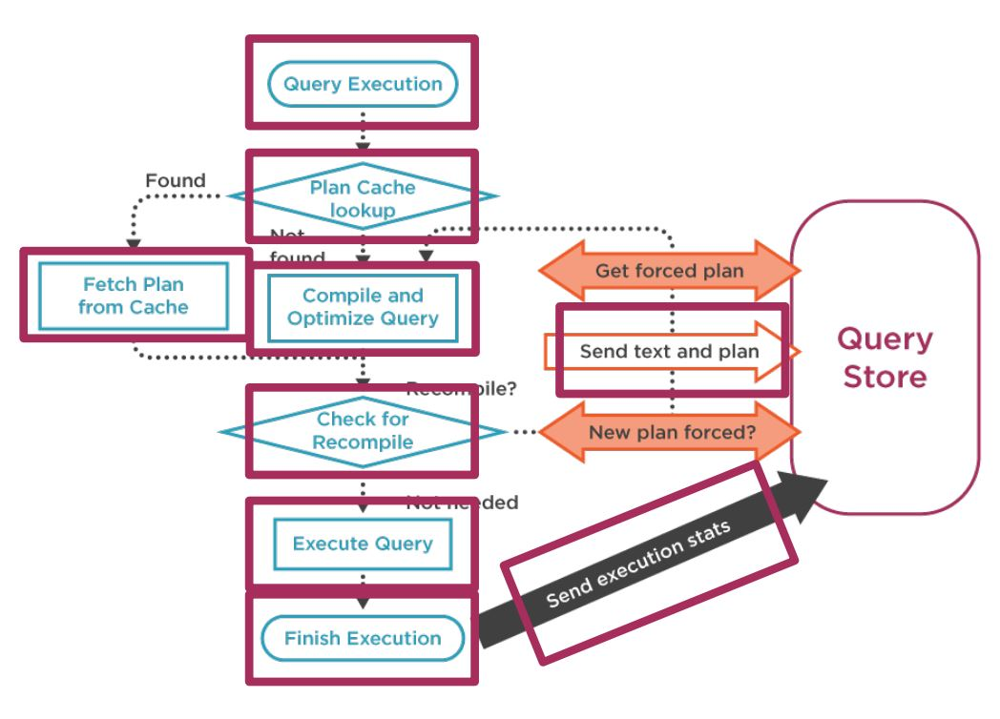
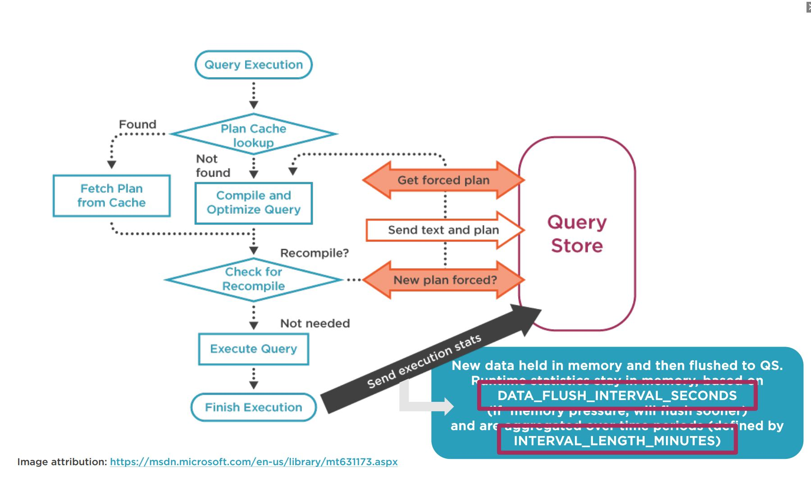
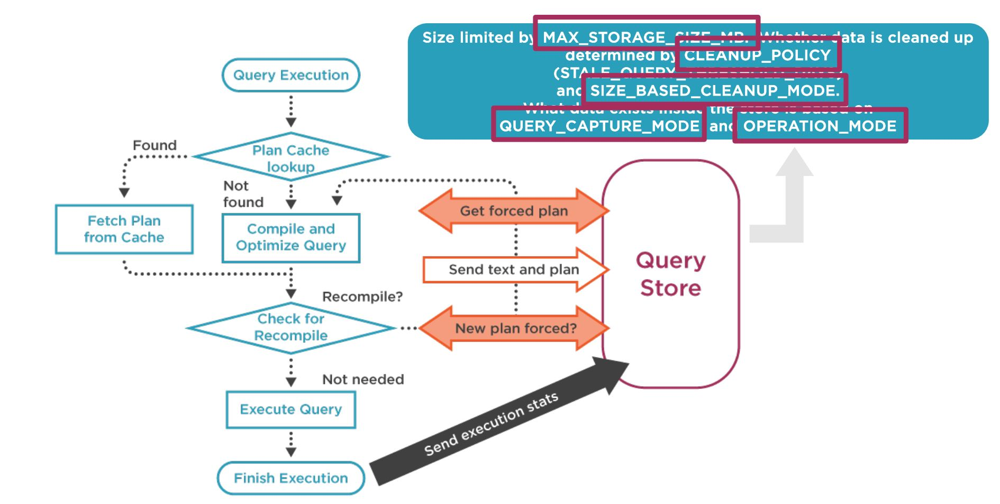

# SQL Server: Introduction to Query Store

Introduction to Query Store.

## 1. Introduction

### Traditional Troubleshooting Tools

Tools for troubleshooting performance:

- performance monitor,
- DMVs, DBCC commands,
- Extended Events / trace,
- query plans,
- CU/SP release notes.

### Baseline Data

> When you're looking at performance, having baseline data is critical.

Baseline data requires planning:

- what data to capture,
- how to capture,
- when to capture,
- where to store,
- how to view/analyze,
- retention policy.

Planning requires **time**.

### Traditional Tools vs. Query Store

Examples of traditional tools:

- SQL Compilations/sec, SQL-Recompilations/sec,
- sys.dm_exec_cached_plans, sys.dm_exec_query_stats, sys.dm_exec_sql_text,
- sp_statement_completed, sql_statement_completed,
- sys.dm_exec_query_plan, SSMS: actual and estimated plans, query_post_execution_showplan.

Capturing this data requires manual intervention or third-party tool ...but not with SQL Server 2016+!

Introducing Query Store!

- billed as a flight data recorder,
- provides information about query execution,
- captures both plan and performance data,
- enabled at the database level,
- available in **all** editions of SQL Server.

| Manual Capture (or 3rd party) | Query Store         |
| ----------------------------- | ------------------- |
| SQL Compilations/sec          | Runtime store stats |
| SQL-Recompilations/sec        | Runtime store stats |
| sys.dm_exec_query_stats       | Runtime store stats |
| sp_statement_completed        | Runtime store stats |
| sql_statement_completed       | Runtime store stats |
| sys.dm_exec_query_plan        | Plan store          |
| sys.dm_exec_sql_text          | Plan store          |

## 2. Defining Query Store

### Query Store Basics

Enabled on a per-database level.

Data persisted in **internal** tables in the user database.

`VIEW DATABASE STATE` permission required to view Query Store data.

`db_owner` needed to force/unforce plans.

Data captured by Query Store:

| Runtime stats store | Plan store |
| ------------------- | ---------- |
| Compile time        | Query text |
| Last execution time | Query plan |
| Duration            | -          |
| CPU                 | -          |
| Logical reads       | -          |
| Physical reads      | -          |
| Writes              | -          |

### Query Store in Action

Showed during the demo.

### Viewing Query Store

Data can be viewed in SSMS for a user database.

Query Store information is accessible via catalog views with T-SQL.

## 3. Implementing Query Store

### Enabling Query Store for a Database

Showed during demo.

### Activating and Collecting Query Store Data

OPERATION_MODE = [READ_WRITE, READ_ONLY]
QUERY_CAPTURE_MODE = [ALL | AUTO | NONE]
MAX_PLANS_PER_QUERY = #

### Query Store Activation and Collection

Showed during demo.

### Storing Query Store Data

MAX_STORAGE_SIZE_MB = #
CLEANUP_POLICY = (STALE_QUERY_THRESHOLD_DAYS = #, STALE_PLAN_THRESHOLD_DAYS = #)
SIZE_BASED_CLEANUP_MODE = [AUTO | OFF]

### Query Store Data Storage

Showed during demo.

### Flushing and Aggregating Query Store Data

INTERVAL_LENGTH_MINUTES = #
DATA_FLUSH_INTERVAL_SECONDS = #

### Query Store Data Flushing and Aggregation

Showed during demo.

### How Query Store Integrates with Query Processing

It is important to understand:

- the compilation and optimization process,
- what settings affect how data is stored.

### Runtime Statistics

Runtime statistics are aggregated over a defined interval of time that can be changed.

## 4. Forcing Plans with Query Store

### Options for Addressing Poor-performing Queries

Change code and/or schema.

Manually get "best" plan in cache.

Use a plan guide.

Force a plan in Query Store.

### Using a Plan Guide to Force a Plan

Showed during demo.

### Plan Guide Details

Multiple options exists (OBJECT, SQL and TEMPLATE) for plan guide creation.

Plan guides allow you to add hints without changing existing code.

Plan guides can be complex to implement.

Not always easy to verify that a plan guide is being used.

### Using Query Store to Force a Plan

Showed during demo.

### Query Store Details and Plan Guides vs. Forcing Plan

Forcing a plan requires the query_id and plan_id.

Query Store allows you to easily find regressed queries with multiple plans and force one plan.

Adding hints changes query text which creates a new query (and query_id) in Query Store.

Currently no way to verify a forced plan is the one that's used.

| Plan Guides                                                  | Forcing Plans                                                |
| ------------------------------------------------------------ | ------------------------------------------------------------ |
| You can force a plan for an ad hoc query or stored procedure | You can force a plan for an ad hoc query or stored procedure |
You can add hints in plan guides without altering query code | Adding a hint to query code \_changes query text
Plan guides can be complex to implement | Forcing a plan in query store is very easy
Verifying guide use via the plan is possible for stored procedures | Verifying a forced plan via then plan is not currently possible

### Common Reasons for Failed Plan Forcing

Showed during demo.

An index used by a plan is altered.

An index used by a plan is dropped.

Query text is changed.

## 5. Practical Uses of Query Store

Establish a baseline with Query Store:

- enable Query Store,
- verify configuration:
  - sys.database_query_store_options,
  - sys.query_store_runtime_stats_interval.

### Understanding Performance with Query Store

Understand the workload:

- what queries are executing?
  - sys.query_store_query,
  - sys.query_store_query_text.
- what are the plans for those queries:
  - sys.query_store_plan.

Examine query performance:

- what do metrics for each query look like?
  - sys.query_store_runtime_stats,
  - sys.query_store_runtime_stats_interval,
- look for differences in context settings:
  - sys.query_context_settings.

Showed during demo.

### Upgrade Testing

SQL Server version.

Hardware.

Application.

### Using Query Store to Test an Application Change

Showed during demo.

### Testing Specific to the Cardinality Estimator

SQL Server 2014 introduced a new Cardinality Estimator.

Using the new CE is _not_ required when upgrading.

Testing prior to upgrading is _highly_ recommended.

### Using Query Store to Test Cardinality Estimator Changes

Showed during demo.

## Summary

Now you know how to use Query Store :-).
